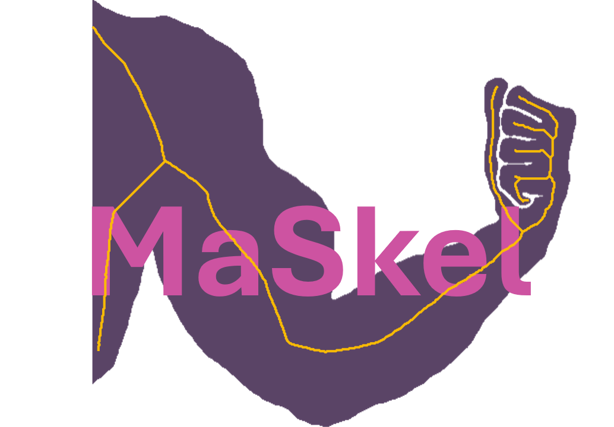

##### Simon Wittmann, Dominik Pysch, Anna Möller

Skeletonization and graph-based feature extraction for branching biological structures — vasculature, fibers, neurites, and other network-like objects — from 2D or 3D binary or multi-label segmentation masks.

Maskel is the core algorithm package: thinning, feature extraction, and the batch CLI. For the napari plugin, see [napari-maskel](https://github.com/bionetslab/napari-maskel). For benchmarks and the HRF-based analysis notebooks, see [maskel-evaluations](https://github.com/bionetslab/maskel-evaluations).

## Full documentation: https://bionetslab.github.io/maskel/

## License

Maskel is released under the **MIT License**. See [LICENSE](LICENSE) for details.
