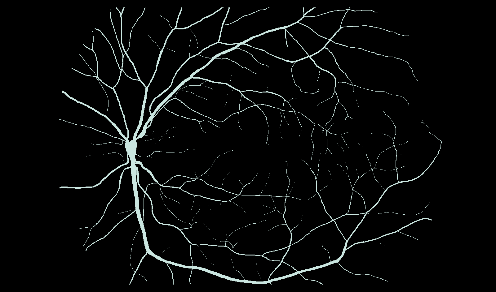
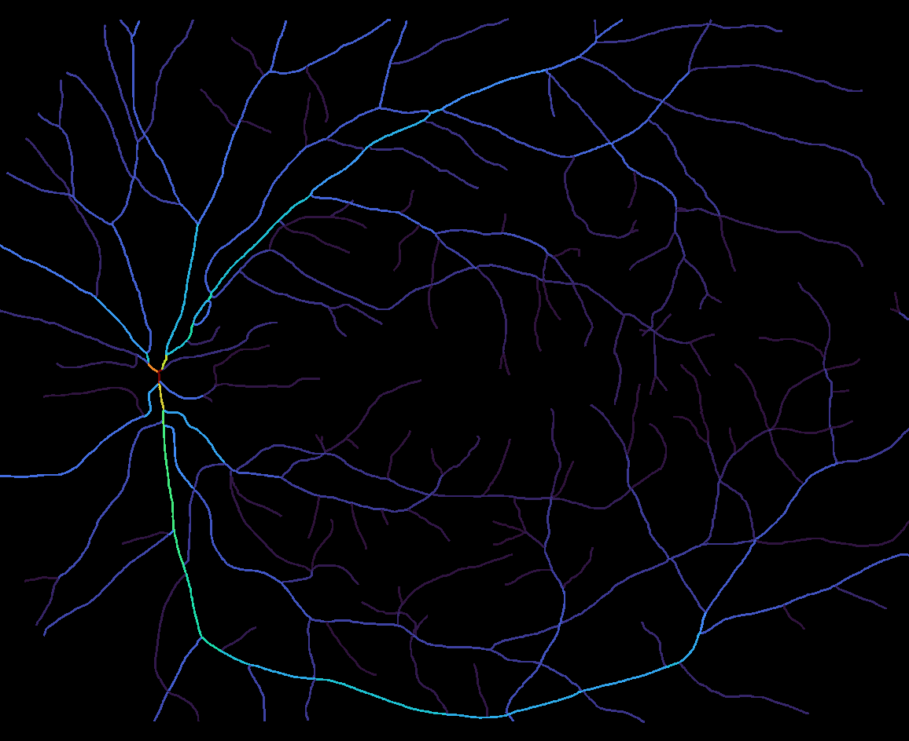
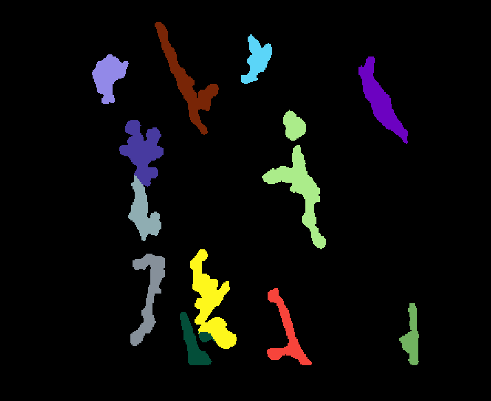
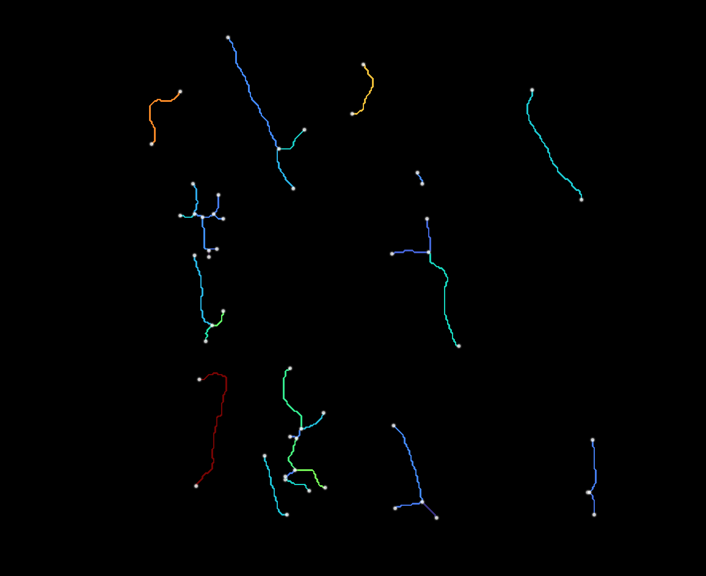

Skeletonization and graph-based feature extraction for branching biological structures — vasculature, fibers, neurites, and other network-like objects — from 2D or 3D binary or multi-label segmentation masks.

Maskel is the core algorithm package: thinning, feature extraction, and the batch CLI. It has no napari dependency — for the interactive napari plugin, see **[napari-maskel](https://bionetslab.github.io/napari-maskel/)**. For benchmarks and the HRF-based analysis notebooks, see [maskel-evaluations](https://github.com/bionetslab/maskel-evaluations) on GitHub.

## What it does

Given a 2D or 3D segmentation mask — either a plain binary mask or a multi-object instance segmentation map — from any imaging modality or biological structure, maskel:

1. Optionally preprocesses the binary mask (morphological closing, hole filling)
2. Thins it to a 1-pixel/voxel skeleton (a fast, Numba-parallelized implementation of Lee et al. 1994 thinning)
3. Builds a graph over the skeleton (edges = branches between junctions/endpoints; the raw node table before filtering covers every skeleton pixel, degree-2 pass-through points included — see [Node-level features](glossary.md#node-level-features-image_nodescsv))
4. Optionally prunes short spur branches and cleans up ambiguous triangle junctions
5. Extracts per-branch, per-node, and per-object summary features (length, tortuosity, radius, fractal dimension, ...)

Touching-but-distinct objects in a multi-object mask are always skeletonized independently, never merged.

## Examples

### 2D binary mask



This is an example of running maskel on a 2D binary segmentation mask. The data is from the [HRF (High-Resolution Fundus) image database](https://www5.cs.fau.de/research/data/fundus-images/) — a manually annotated retinal vessel mask.



The extracted skeleton, colored here by each branch's mean radius (`mean_radius` in `<image>_branches.csv`) — rendered from the exported branch CSV for illustration, since maskel's CLI itself only writes data (CSVs, arrays, graphs), not images. Use the exported `.graphml`/`.pkl` graph, or [napari-maskel](https://bionetslab.github.io/napari-maskel/), to visualize interactively.

### 2D multi-label mask



A multi-object instance segmentation map (more than one distinct nonzero label) is skeletonized independently per object — including two objects that touch, which stay correctly separate rather than merging into one skeleton. This example is the first frame of a video, `MacrophageData_V2/NpyData/EMMACtrl_2021-05-19_visual_labels.npy`, from [Zenodo record 13929787](https://zenodo.org/records/13929787).



Every branch, node, and summary row is tagged with the `object_id` it came from, so the per-object rows in `summary.csv`/`<image>_branches.csv`/`<image>_nodes.csv` stay consistent with the IDs in the original mask. Since maskel's CLI processes a whole batch of images in one call, pointing `--input` at a directory or glob of every frame in this video — with the extraction settings tuned on this one example frame — reproducibly extracts these same per-object features across the whole sequence, one row per object per frame.

## General usage of the CLI

1. Create a starter config: `maskel init config.json` (or export one from napari-maskel's **Save recipe** button — see [Sharing a config with napari-maskel](#sharing-a-config-with-napari-maskel)).
2. Edit `config.json` to set the extraction/output parameters described below.
3. Check it's well-formed: `maskel validate config.json` — prints the normalized config and confirms its `schema_version` is supported.
4. Run it:

```sh
maskel run --input /path/to/images --config config.json --out outputs --jobs 0
```

### Input

`--input` takes one or more of:

- a single file path
- a directory (every supported file directly inside it; add `--recursive` to also search subdirectories)
- a glob pattern (e.g. `"data/*.tif"`; also expanded recursively with `--recursive`)

Supported file extensions: `.png`, `.jpg`, `.jpeg`, `.tif`, `.tiff`, `.bmp`, `.npy`, `.mhd`. Each file is either a plain binary segmentation mask or a multi-object instance segmentation map (see Examples above for how the latter is handled). Two inputs that resolve to the same filename stem (e.g. from different folders) get a numeric suffix (`_2`, `_3`, ...) in their output names, so results never silently overwrite each other.

### Output

`--out` is a directory that ends up containing:

- `summary.csv` — one row per object per image, aggregated across the whole batch
- one subfolder per input image (named after its filename stem), holding whichever per-image/per-object files are enabled under `output` (skeleton array, branch/node CSVs, radius matrix, GraphML/pickle graphs — see Configurable parameters below for exact filenames)

### Spacing override

`--spacing` overrides `extraction.spacing` in the config for the whole run, e.g. `--spacing 2.0 2.0` for 2D or `--spacing 1.0 0.5 0.5` for 3D. An image whose dimensionality doesn't match the given spacing falls back to isotropic spacing for that one image, with a warning, rather than failing the whole batch.

### Parallelism

`--jobs`/`-j` spawns a process pool over the input images, one process per image; `0` uses all CPU cores, and the default, `1`, processes images one at a time in the main process. `Ctrl-C` triggers a clean worker shutdown rather than hanging.

## Configurable parameters

A config JSON has two sections, `extraction` and `output` (plus a `schema_version` — currently 6 — that must match exactly), matching `maskel.config.ExtractionConfig`/`OutputConfig`. It's the same JSON produced by `maskel init`, consumed by `maskel run --config`, and exported/imported by napari-maskel's **Save recipe**/**Load recipe**.

### Physical spacing

- `extraction.spacing` (list[float] or `null`, default `null`) — per-axis physical pixel/voxel size (length must match the image's dimensionality: 2 for 2D, 3 for 3D). When set, length/radius/area/volume features come out in physical units instead of pixel units. A per-image mismatch falls back to `null` (isotropic pixel units) with a warning rather than failing the batch. Box-counting `fractal_dimension` is only valid for isotropic voxels, so it's forced to `0.0` (with a warning) whenever spacing is set and anisotropic. Overridable per-run with `maskel run --spacing`.

### Extraction layers

- `extraction.branches` (bool, default `false`) — extract per-branch features, written to `<image>_branches.csv` when `output.write_branch_csv` is also on.
- `extraction.branch_color_property` (str, default `"tortuosity"`) — which branch property napari-maskel colors its branches layer by. No effect on the CLI's own output; only relevant when the config is shared with the plugin.
- `extraction.branch_text` (bool, default `false`) — whether napari-maskel overlays branch ID/length/tortuosity text on its branches layer. Likewise CLI-inert.
- `extraction.nodes` (bool, default `false`) — extract per-node features, written to `<image>_nodes.csv` when `output.write_node_csv` is also on.
- `extraction.summary` (bool, default `true`) — compute per-object summary features, written to `summary.csv` when `output.write_summary_csv` is also on.

### Cleanup

- `extraction.fill_holes` (bool, default `false`) — fill holes in the binary segmentation before thinning.
- `extraction.max_hole_size` (int, default `0`) — maximum hole area (px) to fill when `fill_holes` is true; `0` fills all holes.
- `extraction.closing_iterations` (int, default `0`) — morphological closing iterations applied before thinning; `0` disables it.
- `extraction.show_preprocessed` (bool, default `false`) — whether napari-maskel adds a layer showing the mask after preprocessing. Purely a display toggle for the plugin; the CLI has no output file for the preprocessed mask.
- `extraction.junction_cleanup` (bool, default `false`) — clean up ambiguous junction pixel clusters left behind by thinning.
- `extraction.cleanup_threshold_factor` (float, default `2.5`) — sensitivity for the above; higher values collapse larger clusters.
- `extraction.prune_spurs` (bool, default `false`) — remove short endpoint-to-junction branches that are thinning artifacts rather than real structure.
- `extraction.min_spur_length` (float, default `10.0`) — branches shorter than this qualify as spurs; in pixel units, or physical units once `spacing` is set.
- `extraction.spur_iterations` (int, default `1`) — how many times pruning repeats on its own output, since removing one spur can expose another.

### Advanced features

- `extraction.fractal_dimension` (bool, default `false`) — compute the skeleton's box-counting fractal dimension as a summary feature (see [Glossary](glossary.md)). Forced to `0.0` whenever `spacing` is set and anisotropic.
- `extraction.mask_radius` (bool, default `false`) — estimate local vessel radius via a Euclidean distance transform of the segmentation. Required for every radius/diameter/volume/surface_area feature at every level (object, branch, node) and for `output.write_radius`.

### Output settings

- `output.write_skeleton_npy` (bool, default `true`) — save the skeleton as `<image>_skeleton.npy`.
- `output.write_skeleton_png` (bool, default `false`) — save the binary skeleton as `<image>_skeleton.png` (skipped with a warning for 3D input).
- `output.write_summary_csv` (bool, default `true`) — write the aggregated `summary.csv`, one row per object per image.
- `output.write_branch_csv` (bool, default `false`) — write `<image>_branches.csv` (requires `extraction.branches`).
- `output.write_node_csv` (bool, default `false`) — write `<image>_nodes.csv` (requires `extraction.nodes`).
- `output.write_radius` (bool, default `false`) — write the per-pixel radius matrix as `<image>_radius.npy` (requires `extraction.mask_radius`).
- `output.write_graphml` (bool, default `false`) — write the skeleton graph as `<image>_<object_id>_graph.graphml`, one file per object (nodes = graph nodes, edges = branches).
- `output.write_networkx_graph` (bool, default `false`) — write the same graph as `<image>_<object_id>_graph.pkl`, a pickled `networkx.MultiGraph` — richer than GraphML (keeps NaN values and native Python types) but only readable from Python.

## Sharing a config with napari-maskel

The same config JSON works in both directions: a file written by `maskel init` (or hand-edited, or produced by any earlier `maskel run`) can be loaded straight into the napari-maskel widget with **Load recipe**, and a config tuned interactively in the widget can be exported with **Save recipe** and passed to `maskel run --config` for reproducible batch processing — as in the multi-label example above. Both consume exactly the same schema described in Configurable parameters, since `maskel.config` is the single source of truth both projects import.

## License

Maskel is released under the **MIT License**. See [LICENSE](https://github.com/bionetslab/maskel/blob/main/LICENSE) for details.
